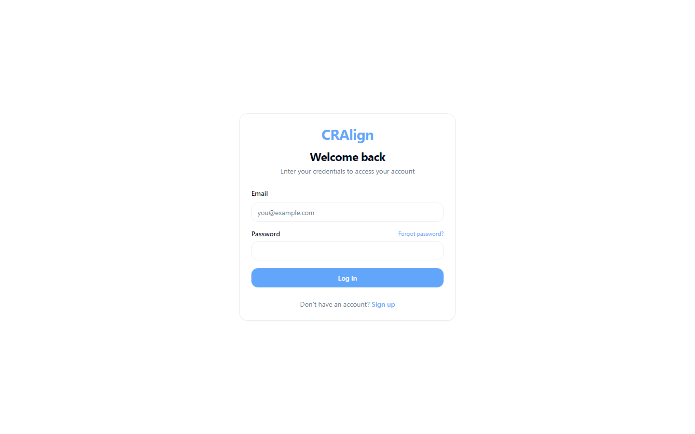

# CRAlign — AI-Assisted Musculoskeletal Wellness Platform

> **AI-assisted musculoskeletal assessment with a licensed-clinician review workflow at its core.**

CRAlign is a platform for musculoskeletal (MSK) wellness assessment that pairs AI-assisted intake and analysis with a structured clinician review step — built privacy-first, with a compliance-minded architecture.

---

## Screenshots

A look at the CRAlign platform interface.

| Sign In | Create Account |
|:---:|:---:|
|  |  |

- **Sign In** — secure, role-based access for clinicians and patients.
- **Create Account** — streamlined onboarding into the MSK assessment and clinician-review workflow.

---

## What is CRAlign?

**CRAlign is an AI-assisted musculoskeletal wellness assessment platform.** It guides a patient through a conversational intake, helps structure and analyze the information, and routes every assessment through a **licensed clinician review workflow** before anything is finalized.

It is designed for **rehabilitation clinics, physical therapy practices, and telehealth providers** that want to make MSK intake and assessment more efficient — while keeping a qualified human clinician in the loop.

> CRAlign supports clinicians; it does not replace professional medical judgment, diagnosis, or care.

---

## Key Features

- **Conversational intake** — a guided, patient-friendly assessment experience.
- **AI-assisted analysis** — helps structure and surface relevant information for the clinician.
- **Clinician review workflow** — every assessment is reviewed by a licensed clinician before it's finalized.
- **State-based assignment** — routes cases to appropriately licensed clinicians.
- **Role-based access** — separate, permissioned experiences for patients and clinicians.
- **Journaling & progress tracking** — supports ongoing rehabilitation, not just one-time intake.
- **Compliance-minded architecture** — built with privacy and healthcare data handling as a first principle.

---

## Who It's For

| Audience | Why CRAlign helps |
|----------|-------------------|
| **Rehabilitation clinics** | Streamline MSK intake and assessment workflows. |
| **Physical therapy practices** | Spend clinician time on judgment, not paperwork. |
| **Telehealth providers** | Offer structured remote MSK assessment. |
| **Clinician networks** | Route cases to the right licensed professional. |

---

## How It Works

1. **Patient intake** — the patient completes a guided, conversational assessment.
2. **AI-assisted structuring** — the platform organizes and analyzes the intake information.
3. **Clinician review** — a licensed clinician reviews the assessment within a structured workflow.
4. **Finalization** — the reviewed assessment becomes the basis for next steps.
5. **Ongoing tracking** — journaling and progress features support the rehabilitation journey.

---

## Technology

- **Backend:** Python, FastAPI
- **Frontend:** React
- **Data:** Supabase
- **AI:** large language models for assisted intake and analysis
- **Architecture:** role-based access, clinician review workflow, compliance-minded data handling

> This repository is a **public showcase**. It documents the product — it does not contain the assessment logic, clinical workflows, or any source code. CRAlign is currently at MVP stage.

---

## Frequently Asked Questions

**Does CRAlign replace a doctor or physical therapist?**
No. CRAlign is an assistive platform. Every assessment goes through a licensed clinician review workflow — a qualified human always stays in the loop.

**What does "AI-assisted" mean here?**
The AI helps with conversational intake and with structuring and surfacing information. It supports the clinician; it does not make clinical decisions.

**Is it built for healthcare data privacy?**
Yes. CRAlign is built with a compliance-minded, privacy-first architecture.

**What is the clinician review workflow?**
A structured step where a licensed clinician reviews each assessment before it is finalized, including routing to appropriately licensed professionals.

**What stage is the product at?**
CRAlign is currently at MVP stage.

**Is this open source?**
No. This repository is a marketing showcase. The product is proprietary — see the license.

**How do I learn more or see a demo?**
See the **Contact** section below.

---

## Why CRAlign

- 🩺 **Clinician-in-the-loop** — AI assists, licensed professionals decide.
- 🔒 **Privacy-first** — compliance-minded architecture from the ground up.
- 🔁 **Workflow-native** — built around how clinics actually operate.
- 📈 **Continuity** — supports ongoing rehabilitation, not just intake.

---

## Contact & Demo

Interested in CRAlign for your clinic or telehealth practice?

- **GitHub:** [@maaz-gobi](https://github.com/maaz-gobi)
- **Inquiries:** open an issue in this repository, or reach out via GitHub.

We work with rehabilitation and telehealth providers to streamline MSK assessment workflows.

---

## License

This is a proprietary product. This repository contains documentation and marketing materials only. See [LICENSE](LICENSE) for terms.

---

**Keywords:** musculoskeletal assessment, MSK wellness, AI health tech, clinician review workflow, physical therapy software, rehabilitation platform, telehealth assessment, AI-assisted intake, patient intake software, healthcare AI, MSK screening, digital health, clinician-in-the-loop AI.
